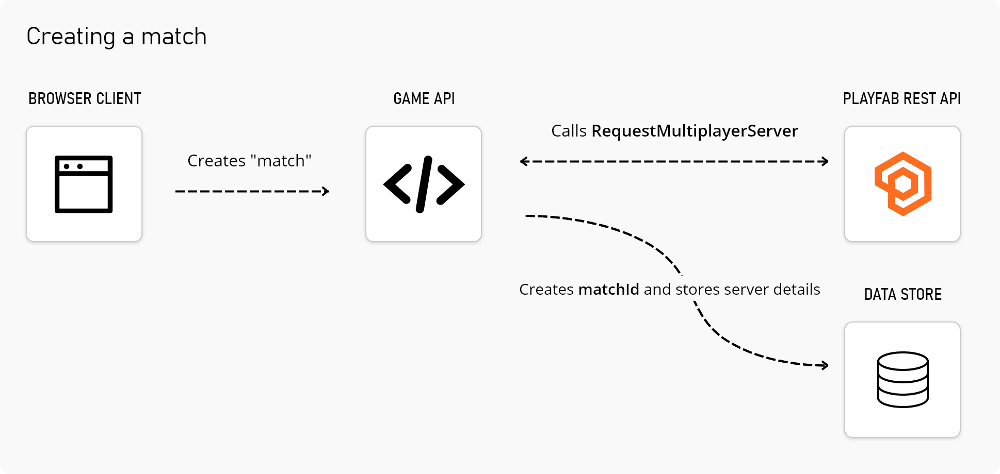
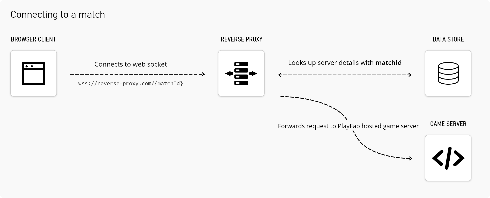

This repository contains sample code for building a reverse proxy that enables secure websocket connections to PlayFab hosted multiplayer servers. This repository is not an official solution, but a starting point for developers who are looking to deploy their game to a browser via websockets.

## The problem
Developers who choose to support WebSocket connections to their game server face a problem when these connections originate from a `https://` domain. PlayFab hosted game servers are typically accessible from a subdomain of `azure.com`. For security reasons, PlayFab cannot issue SSL certificates to developers to use for their `azure.com` hosted game server.

Browser security policies require that WebSocket connections originating from `https://` are created with a secure connection (_WebSocket over https_ or `wss://`).

## A solution
A reverse proxy can be used to forward requests from a `https://` domain to a PlayFab hosted game server, without the need for an SSL certificate on the game server.

**Consider the following flows**

### Creating a match
1. A user requests a "match", or server to connect to. This sends a request to the game's API.
2. The game's API calls the PlayFab [RequestMultiplayerServer](https://docs.microsoft.com/en-us/rest/api/playfab/multiplayer/multiplayer-server/request-multiplayer-server?view=playfab-rest) REST API and stores the server details with an identifier representing this "match" - we'll call it **matchId**.

### Connecting to a match
1. Your game's browser client initiates a connection to your reverse proxy with the previous **matchId**. i.e. `wss://reverse-proxy.com/{matchId}`.
2. The reverse proxy looks up the previously stored server details for the given **matchId** and forwards the request to your `azure.com` hosted game server.

## Need help?
While this is not an official solution, the best channel to discuss this respository or receive help is to [open an issue](https://github.com/PlayFab/MultiplayerServerSecureWebsocket/issues/new/choose).
